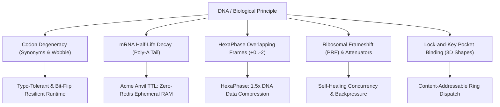

# 📺 SMC (Saturday Morning Cartoons) Master Handbook
### *The Definitive Guide to Biologically Inspired, Fault-Tolerant Software Architecture*

[](https://pypi.org/project/smc-lang/)
[](https://github.com/zekvftb/smc-lang/blob/main/LICENSE)
[](https://github.com/zekvftb/smc-lang/actions)
[](https://zekvftb.github.io/smc-lang/)

---

## 🌟 Why Use SMC? (The 5 Breakthrough Superpowers)

Modern software architectures face massive hurdles: memory leaks, cache server costs (Redis/Memcached clusters), rigid syntax crashes, fragile network pointer routing, and runaway thread contention. 

**DNA solved these problems 3.8 billion years ago.** SMC translates nature's most resilient computing tricks into modern programming:



| Superpower | Biological Origin | Real-World Software Utility |
| :--- | :--- | :--- |
| **1. Acme TTL Ephemeral Memory** | mRNA degradation (poly-A tail shortening) | **Eliminates external Redis clusters.** Ephemeral variables auto-vaporize from RAM with zero memory leaks and 0% GC pauses. |
| **2. HexaPhase Multiplexing** | $\Phi$X174 & viral overlapping reading frames | **High-Density DNA Data Storage.** Encodes multiple data streams on the exact same physical sequence ($1.5\times$ space savings). |
| **3. Wobble Typo-Tolerance** | 64 codons $\rightarrow$ 20 amino acids (3rd base wobble) | **Radiation & Cosmic-Ray Resilience.** Absorbs single-bit memory flips and minor syntax errors without fatal kernel crashes. |
| **4. PRF Slipping & Attenuators** | Ribosome slippery sites & RNA stem-loops | **Self-Healing Traffic Backpressure.** Automatically rate-limits load and shifts execution into emergency tracks under stress. |
| **5. Shape-Based Ring Dispatch** | Lock-and-key receptor binding | **Decoupled Event Architecture.** Replaces fragile numeric pointers (`0x7FFF`) with elemental/planetary categorical dispatch. |

---

## ⚡ 60-Second Quickstart

### 1. Installation
```powershell
pip install smc-lang
```

### 2. Scaffold a New Project
```powershell
smc init my_app
cd my_app
smc run main.smc
```

### 3. Launch the Interactive REPL
```powershell
smc repl
```

### 4. Zero-Install Web Playground
👉 **[Try SMC Live in Your Browser](https://zekvftb.github.io/smc-lang/)** *(Runs 100% client-side on mobile and desktop)*

---

## 🛠️ The Practical Cookbook: 7 Production-Ready Blueprints

---

### 1. 🌐 Zero-Redis Web Server (Native HTTP + Ephemeral Sessions)
*Eliminate external caching servers. Sessions and OTP tokens automatically decay in process RAM.*

```smc
experiment "Zero_Redis_Auth_Server"

let request_count = 0

fn handle_request(req) {
    let p = req["path"]
    let m = req["method"]
    request_count += 1

    # 1. Homepage Route
    if (p == "/") {
        return {
            "status": 200,
            "content_type": "text/html",
            "body": `<h1>SMC Laboratory Server</h1><p>Requests processed: <b>${request_count}</b></p>`
        }
    }

    # 2. Ephemeral Login Route (Zero-Redis Session Token!)
    if (p == "/login") {
        # Session token automatically vaporizes from RAM in 3 request cycles
        acme(ttl=3) auth_token = py_call("secrets.token_hex", 16)
        return {
            "status": 200,
            "content_type": "application/json",
            "body": to_json({
                "session_token": auth_token,
                "ttl_cycles": 3,
                "note": "Token will auto-expire from RAM with zero Redis server overhead!"
            })
        }
    }

    return { "status": 404, "body": "Not Found" }
}

# Start embedded web server on port 3000
serve_http(3000, "handle_request")
```

---

### 2. 🧬 HexaPhase DNA Data Storage Compressor
*Interleave two separate digital files into one sequence for $1.5\times$ physical storage density.*

```smc
experiment "DNA_Data_Storage_Compiler"

let payload_audio = "METRIC_AUDIO_STREAM_TRACK"
let payload_video = "HIGH_DEF_OPTICAL_SIGNAL"

# Interleave both streams into a single multi-phase DNA string
let multiplexed_dna = hexaphase_compile(payload_audio, payload_video)
print `Compressed DNA Locus: ${multiplexed_dna}`

# Decompile all 6 forward (+0, +1, +2) and antisense (-0, -1, -2) channels
let channels = hexaphase_channels(multiplexed_dna)

print "--- Extracted Channels ---"
print `Primary Forward Channel (+0):    ${channels["+0"]}`
print `Secondary Interleaved Track (+1): ${channels["+1"]}`
print `Antisense Reverse Track (-0):     ${channels["-0"]}`

halt
```

---

### 3. 🛡️ Self-Healing Backpressure & Rate-Limiting Gate
*Prevent server crashes under traffic spikes using thermodynamic stem-loop pause gates.*

```smc
experiment "Adaptive_Load_Manager"

let system_load = 94 # High load percentage

# 1. Dynamic Programmed Ribosomal Frameshift (PRF)
if (system_load > 90) {
    slip(1) # Dynamically shifts execution track into Phase +1 emergency channel
    print `[SURGE] System load critical (${system_load}%). Execution slipped to Phase +${current_phase}!`
}

# 2. Thermodynamic Attenuator Pause Gate
attenuator(threshold = 500) {
    print "Attenuator Gate Active: Rate-limiting biological request queue."
}

halt
```

---

### 4. 🐍 Python Scientific Ecosystem Bridge (FFI)
*Seamlessly call NumPy, PyTorch, SciPy, and Python standard libraries with zero boilerplate.*

```smc
experiment "Scientific_Python_Bridge"

# 1. Direct Python Standard Library Execution
let root = py_call("math.sqrt", 1024)
let pi_val = py_eval("math.pi")
print `Square root of 1024: ${root}`
print `Constant Pi: ${pi_val}`

# 2. Dynamic Date & Cryptographic Module Import
py_import "datetime" as dt
let current_time = py_call("datetime.datetime.now")
print `System Timestamp: ${current_time}`

# 3. Randomization
let random_seed = py_call("random.randint", 1000, 9999)
print `Cryptographic Seed: ${random_seed}`

halt
```

---

### 5. ⚔️ Townsville RPG Game State Machine (Dictionaries & Loops)

```smc
experiment "Townsville_RPG"

let hero = {
    "name": "Blossom",
    "hp": 120,
    "attack": 25,
    "inventory": ["Laser_Vision", "Power_Shield"]
}

let villain = {
    "name": "Mojo_Jojo",
    "hp": 150,
    "attack": 18
}

fn attack_round(attacker, defender) {
    # Acme critical strike boost (expires in 2 turns)
    acme(ttl=2) crit_boost = 10
    let total_dmg = attacker["attack"] + crit_boost
    defender["hp"] -= total_dmg
    print `${attacker["name"]} attacks ${defender["name"]} for ${total_dmg} damage!`
}

while (villain["hp"] > 0) {
    attack_round(hero, villain)
    print `Mojo Jojo HP remaining: ${villain["hp"]}`
    if (villain["hp"] <= 0) {
        print "Mojo Jojo defeated! Townsville is saved once again."
    }
}

halt
```

---

### 6. 💍 Content-Addressable Ring Dispatch (Captain Planet / Senshi)
*Decoupled event handling using planetary shapes instead of fragile numeric pointers.*

```smc
experiment "Elemental_Event_Bus"

# Register shape-based event listeners
bind(ring="FIRE") {
    print "[EVENT] Fire element triggered: Heating chemical reactor."
}

bind(ring="WATER") {
    print "[EVENT] Water element triggered: Cooling condenser coils."
}

# Tuxedo Mask Watchdog: catches any unrouted event safely
fallback {
    print "[WATCHDOG] Unrouted event caught safely. 'My work here is done!'"
}

# Dispatch events
dispatch "FIRE"
dispatch "WATER"
dispatch "UNKNOWN_SERVICE" # Triggers Tuxedo Mask watchdog

halt
```

---

### 7. 🧬 CatDog Dual-Frame Overlapping Execution
*Two completely independent subroutines interleaved on the exact same lines of code.*

```smc
# Save as dual_frame.smc
KAMEHAMEHA KAMEHAMEHA "Cat: Tea and classical literature." "Dog: Let's chase cars!"
KAMEHAMEHA KAMEHAMEHA "Cat: Elegant afternoon nap." "Dog: Ball! Ball! Ball!"
THATS_ALL_FOLKS THATS_ALL_FOLKS
```

Execute both independent tracks:
```powershell
smc catdog dual_frame.smc
```

---

## 📖 Complete Standard Library Reference

| Built-in Function | Syntax | Description |
| :--- | :--- | :--- |
| `len` | `len(container)` | Returns length of list, string, or dictionary |
| `push` | `push(list, item)` | Appends element to list |
| `pop` | `pop(list)` | Removes and returns last element |
| `str` / `int` | `str(x)` / `int(x)` | Typecasting with safe fallbacks (never raises ValueError) |
| `type` | `type(x)` | Returns `"list"`, `"dict"`, `"bool"`, `"number"`, `"str"` |
| `read_file` | `read_file(path)` | Reads UTF-8 file contents from disk |
| `write_file` | `write_file(path, data)` | Writes UTF-8 string to disk |
| `serve_file` | `serve_file(path, mime)` | Prepares HTTP response payload |
| `to_json` | `to_json(data)` | Formats data structure as JSON string |
| `from_json` | `from_json(str)` | Parses JSON string into dictionary/list |
| `range` | `range(start, end, step)` | Generates numerical sequence list |
| `split` / `join` | `split(s, sep)` / `join(list, sep)` | String tokenization and concatenation |
| `keys` / `values`| `keys(dict)` / `values(dict)` | Returns list of dictionary keys or values |
| `contains` | `contains(container, item)` | Tests element membership |
| `hexaphase_compile` | `hexaphase_compile(s1, s2)` | Interleaves two streams into multiplexed DNA |
| `hexaphase_channels`| `hexaphase_channels(s)` | Slices stream into 6 channels (`+0..-2`) |
| `phase_slip` | `phase_slip(s, offset)` | Shifts string index by phase offset |
| `py_call` | `py_call("mod.fn", *args)` | Direct Python FFI call |
| `py_eval` | `py_eval("expr")` | Evaluates Python expression in sandbox |
| `py_import` | `py_import("mod", "alias")` | Imports Python ecosystem module |
| `serve_http` | `serve_http(port, "handler")` | Launches native embedded web server |

---

## 💻 Developer Tooling & Ecosystem

### 1. VS Code Extension
Syntax highlighting, bracket colorization, and opcode autocompletion:
```powershell
code --install-extension editors/vscode/smc-lang-0.7.0.vsix
```

### 2. Inspecting Repaired Mutations
See how codon degeneracy absorbs typos and bit-flips in real-time:
```powershell
smc tokens my_script.smc
```

### 3. Fair-Source 1.0 License
SMC is **100% Free & Open Source for individuals, researchers, and educational institutions**, with enterprise commercial licensing available.

---

### 🧪 Ready to Experiment?
```powershell
pip install smc-lang
smc repl
```
Welcome to Saturday Morning Cartoons! 🚀
